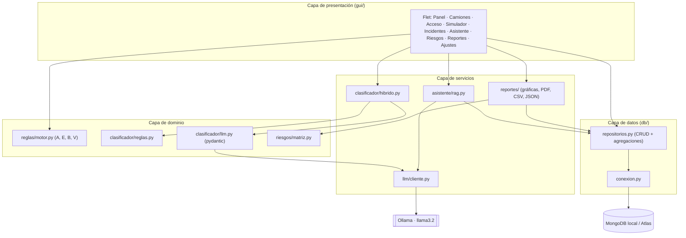
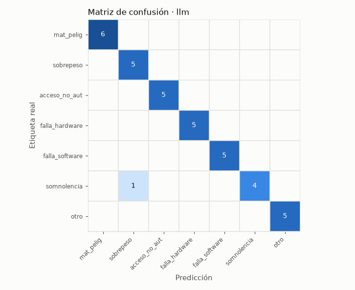
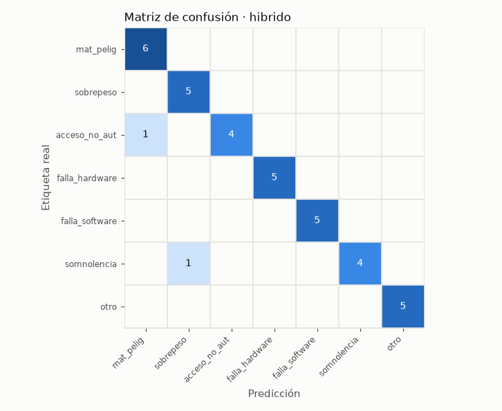
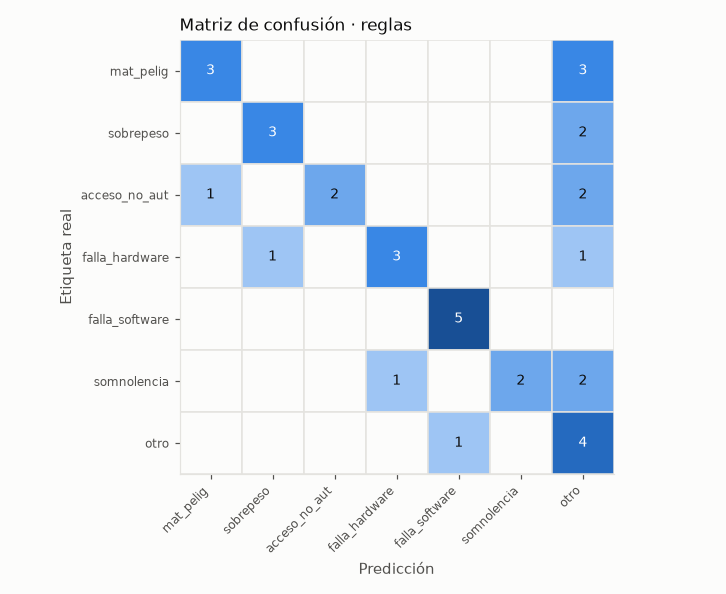

# Informe técnico · LogiSmart

**Materia:** Fundamentos de IA · Unidad 2
**Proyecto:** transformación de `logiuncodigo.py` en una aplicación modular con MongoDB, LLM local y GUI.

---

## 1. Objetivo

El script original resolvía cuatro tareas en un solo archivo y en memoria: diseño PEAS, motor de reglas,
clasificador de incidentes y matriz de riesgos éticos. Esta versión:

1. Separa el código en **capas** (datos, dominio, servicios y presentación).
2. **Persiste** toda la operación en MongoDB (local o Atlas).
3. Integra un **LLM local (Ollama)** con salida JSON validada y plan de respaldo.
4. Ofrece una **GUI en Flet** que se opera sin tocar código.
5. Evalúa los **riesgos éticos de su propia implementación** con evidencia del experimento.

---

## 2. Arquitectura



| Capa | Módulos | Responsabilidad |
|---|---|---|
| Presentación | `gui/app.py`, `gui/vistas/*` | Pantallas, validación de entradas, indicadores de carga, mensajes de error |
| Servicios | `clasificador/hibrido.py`, `asistente/rag.py`, `reportes/*`, `llm/cliente.py` | Orquestan dominio + datos + LLM |
| Dominio | `reglas/motor.py`, `reglas/peas.py`, `clasificador/reglas.py`, `clasificador/llm.py`, `riesgos/matriz.py` | Lógica pura, sin interfaz ni base de datos (fácil de probar) |
| Datos | `db/conexion.py`, `db/repositorios.py`, `db/datos_demo.py` | Acceso a MongoDB y conversión de errores |

**Decisiones de diseño**

- Las capas de dominio no importan nada de la GUI ni de MongoDB; por eso las pruebas del script original
  se portaron sin cambios.
- Todo error de MongoDB se convierte en `ErrorBaseDatos` con un mensaje claro; la GUI lo muestra en un aviso
  y en la insignia de conexión, sin cerrarse.
- Las llamadas lentas (MongoDB, LLM) se ejecutan en un hilo (`asyncio.to_thread`) para no congelar la ventana.
- La conexión (`MONGO_URI`, `OLLAMA_HOST`) vive en `.env` (no se sube a Git). Los ajustes editables desde la GUI
  viven en `config.json`.

---

## 3. Esquema de colecciones (MongoDB)

### `camiones`
| Campo | Tipo | Descripción |
|---|---|---|
| `camion_id` | string, único | `CAM-102` |
| `placa` | string, único | `ABC-123-D` |
| `empresa` | string | Transportista |
| `autorizado` | bool | Premisa **P** |
| `conductor` | string | Nombre (ficticio en la demo) |
| `certificacion_vence` | date | De aquí salen **S** (vigente) y **T** (por vencer) |
| `fecha_alta` | date | |

### `accesos` (bitácora del motor de reglas)
| Campo | Tipo | Descripción |
|---|---|---|
| `camion_id`, `placa`, `empresa` | string | Camión evaluado |
| `peso_kg`, `carga_peligrosa` | number, bool | Lo que captura el operador |
| `premisas` | object | `{P, Q, R, S, H, T}` |
| `detalle_premisas` | object | De dónde salió cada premisa |
| `reglas` | object | `{A, E, B, V}` |
| `reglas_activadas` | array | Reglas verdaderas |
| `resultado` | string | `verde` / `amarillo` / `rojo` |
| `decision`, `causa` | string | Texto de la decisión y regla que la causó |
| `explicacion` | array | Pasos de la evaluación |
| `operador`, `origen`, `fecha` | string, string, date | Marca de tiempo y responsable |

### `incidentes`
| Campo | Tipo | Descripción |
|---|---|---|
| `remitente`, `asunto`, `cuerpo` | string | **Correo original** |
| `categoria`, `prioridad`, `resumen` | string | Clasificación final |
| `entidades` | object | `{placa, camion_id, peso_reportado_kg, ubicacion}` (**datos extraídos**) |
| `fuente_clasificacion` | string | `hibrido`, `reglas_respaldo`, `reglas` |
| `requiere_revision_humana`, `motivo_revision` | bool, string | Resultado de la fusión |
| `detalle_clasificacion` | object | Resultado de reglas, del LLM, intentos y latencia |
| `estado` | string | `nuevo` → `en_atencion` → `cerrado` |
| `correo_soporte` | object | Resultado del envío (simulado o SMTP) |
| `historial` | array | `{fecha, accion, detalle, usuario}` en cada cambio |

### `riesgos_eticos`
| Campo | Tipo | Descripción |
|---|---|---|
| `modulo`, `descripcion`, `categoria` | string | Categorías: sesgo, privacidad, transparencia, seguridad, responsabilidad, otro |
| `probabilidad`, `impacto` | int 1-5 | Riesgo **inherente** |
| `mitigacion` | string | |
| `probabilidad_residual`, `impacto_residual` | int 1-5 | Riesgo **residual** (después de mitigar) |
| `historico` | array | `{fecha, usuario, accion, cambios: {campo: [antes, después]}}` |

### `evaluaciones_llm`
| Campo | Tipo | Descripción |
|---|---|---|
| `tipo` | string | `clasificacion`, `asistente`, `experimento` |
| `prompt`, `respuesta`, `modelo` | string | |
| `latencia_ms` | number | |
| `json_valido`, `intentos`, `errores` | bool, int, array | Validación pydantic |
| `coincidio_con_reglas` | bool | Si el LLM coincidió con el clasificador por reglas |
| `categoria_llm`, `categoria_reglas` | string | Para análisis posterior |

**Índices:** `camiones.camion_id` y `camiones.placa` (únicos), `accesos.fecha`, `accesos.camion_id`,
`incidentes.fecha`, `incidentes.estado`.

**Agregación (incidentes por categoría y semana)** en `repositorios.incidentes_por_categoria_semana()`:

```javascript
[
  { $match: { fecha: { $gte: desde, $lte: hasta } } },
  { $group: { _id: { categoria: "$categoria",
                     semana: { $dateToString: { format: "%G-W%V", date: "$fecha" } } },
              total: { $sum: 1 } } },
  { $project: { _id: 0, categoria: "$_id.categoria", semana: "$_id.semana", total: 1 } },
  { $sort: { semana: 1, categoria: 1 } }
]
```

---

## 4. Motor de reglas

### Premisas
| | Premisa | Origen |
|---|---|---|
| P | Autorización previa | Catálogo de camiones |
| Q | Peso excede el límite | Báscula vs umbral configurable (40 000 kg) |
| R | Materiales peligrosos | Operador |
| S | Certificación vigente | Fecha de vencimiento ≥ hoy |
| **H** | **Horario restringido (22:00-06:00)** | Hora de llegada (nueva) |
| **T** | **Certificación vence en ≤ 30 días** | Fecha de vencimiento (nueva) |

### Reglas
| Regla | Fórmula | Justificación |
|---|---|---|
| A · Acceso estándar | P ∧ S ∧ ¬Q | Original |
| E · Inspección especial | P ∧ (R ∨ Q) | Original |
| **B · Bloqueo por horario** | **R ∧ H** | De noche hay menos personal de seguridad y menor visibilidad, y la respuesta ante un derrame es más lenta; la carga peligrosa se reprograma |
| **V · Aviso de renovación** | **S ∧ T** | Avisa antes de que la certificación venza, para no rechazar al conductor en una visita futura |

### Prioridad de decisión (ante la duda, seguridad)
1. ¬P → **rojo** · 2. B → **rojo** · 3. E → **amarillo** · 4. A → **verde** (con aviso si V) · 5. otro caso → **rojo**

### Tablas de verdad

**A y E (16 combinaciones, original):**

| P | Q | R | S | A | E |
|---|---|---|---|---|---|
| V | V | V | V | F | V |
| V | V | V | F | F | V |
| V | V | F | V | F | V |
| V | V | F | F | F | V |
| V | F | V | V | V | V |
| V | F | V | F | F | V |
| V | F | F | V | V | F |
| V | F | F | F | F | F |
| F | * | * | * | F | F |

**B = R ∧ H**

| R | H | B |
|---|---|---|
| V | V | V |
| V | F | F |
| F | V | F |
| F | F | F |

**V = S ∧ T**

| S | T | V |
|---|---|---|
| V | V | V |
| V | F | F |
| F | V | F |
| F | F | F |

### Reto opcional: contradicciones y redundancias (`motor.analizar_reglas()`)

Recorriendo las 64 combinaciones de P, Q, R, S, H, T:

- **Conflicto A y B:** 2 combinaciones permiten el acceso (A) y a la vez lo bloquean (B), por ejemplo
  P, ¬Q, R, S, H. Se resuelve porque **B tiene prioridad**.
- **Conflicto A y E:** 4 combinaciones dan acceso estándar e inspección a la vez. Prevalece **E**.
- **Implicaciones:** A ⇒ P, A ⇒ S, E ⇒ P, B ⇒ R, B ⇒ H, V ⇒ S, V ⇒ T. V no compite con otras reglas,
  solo agrega un aviso.
- **Premisas contradictorias:** T ∧ ¬S (16 de 64) es imposible en la realidad, porque una certificación
  "por vencer" sigue vigente. El motor la marca con una advertencia.

Cada decisión se guarda en `accesos` con la **explicación paso a paso**, por ejemplo:

```
Premisas: P=V, Q=F, R=V, S=V, H=F, T=F
A = P ∧ S ∧ ¬Q = V ∧ V ∧ V = V
E = P ∧ (R ∨ Q) = V ∧ (V ∨ F) = V
B = R ∧ H = V ∧ F = F
V = S ∧ T = V ∧ F = F
Decisión: Enviar a inspección especial por materiales peligrosos. Causa: E es verdadera (prioridad 3).
A también es verdadera, pero la inspección especial tiene prioridad (seguridad)
```

---

## 5. Clasificador híbrido

1. **Reglas:** palabras clave y regex del script original (base reproducible y respaldo).
2. **LLM:** recibe el correo y debe devolver JSON con el **esquema exacto**, validado con pydantic
   (`extra="forbid"`, categorías y prioridades como `Literal`). Además el esquema se pasa a Ollama con
   `format=` para restringir la salida.
3. **Reintento:** si el JSON es inválido, se reintenta explicando al modelo el error de validación.
   Si vuelve a fallar, o Ollama no responde, se usa el clasificador por reglas (`reglas_respaldo`).
4. **Fusión:** si LLM y reglas coinciden, se usa ese resultado. Si discrepan, **prevalece la prioridad más
   alta** y se marca `requiere_revision_humana`. Las entidades del regex tienen preferencia y el LLM completa
   las que falten.

Esquema exigido al LLM:

```json
{"categoria": "materiales_peligrosos|sobrepeso|acceso_no_autorizado|falla_hardware|falla_software|somnolencia_conductor|otro",
 "prioridad": "baja|media|alta|critica",
 "entidades": {"placa": "string|null", "camion_id": "string|null",
               "peso_reportado_kg": "number|null", "ubicacion": "string|null"},
 "resumen": "string (5-400 caracteres)"}
```

---

## 6. Prompts usados

**Clasificador (system)**, en `clasificador/llm.py`: define las 7 categorías con criterios, las 4 prioridades
con ejemplos, cómo extraer entidades (null si no aparecen, toneladas × 1000), un resumen de máximo 25 palabras,
la instrucción "no inventes datos" y el formato JSON exacto. El mensaje de usuario es
`Asunto: … / Cuerpo: …`.

**Reintento:** `Tu respuesta no cumple el esquema: <errores de pydantic>. Responde de nuevo SOLO con el JSON en el formato exacto.`

**Asistente RAG (system)**, en `asistente/rag.py`:

> Responde ÚNICAMENTE con los registros del CONTEXTO. No uses conocimiento externo. Cita el registro de cada
> dato con su etiqueta exacta, por ejemplo [accesos#a1b2c3]. Si el CONTEXTO no contiene la respuesta, responde
> exactamente "No tengo información." Para decisiones de acceso usa decision, causa y explicacion.

El mensaje de usuario es `CONTEXTO: [ref] registro… / PREGUNTA: …`. **Patrón RAG:** primero se consulta MongoDB
(por ID de camión, placa o tema: incidentes, accesos, riesgos) y después se arma el contexto. **Si no hay
registros, se responde "No tengo información" sin llamar al LLM**, así el modelo no tiene oportunidad de
inventar. La GUI muestra las fuentes consultadas y avisa si la respuesta no las citó.

---

## 7. Experimento de clasificación

**Conjunto:** 36 correos etiquetados a mano (`experimento/correos_etiquetados.json`), 5-6 por categoría.
Incluye **6 correos con ortografía informal** ("ai un derame en el anden", "la vascula dice 52 ton") y casos
difíciles a propósito: sinónimos sin palabra clave ("olor a gasolina", "tambo de ácido"), palabras que
confunden a las reglas ("se dio a la **fuga**" en un acceso no autorizado, "**báscula** descalibrada" en una
falla de hardware) y empates entre categorías.

**Métricas:** exactitud de categoría y de prioridad, exactitud separada en correos formales e informales,
exhaustividad por clase, matriz de confusión y latencia, para **reglas, LLM e híbrido**.

**Ejecución:** `python3 -m experimento.evaluar`. Genera `experimento/resultados.json`,
`docs/resultados_experimento.md` y las matrices en `docs/img/`. Cada llamada se guarda en `evaluaciones_llm`.

### Resultados

<!-- RESULTADOS_INICIO (esta tabla la actualiza automáticamente experimento/evaluar.py) -->
| Clasificador | Exactitud categoría | Exactitud prioridad | Formal (30) | Informal (6) | Latencia promedio |
|---|---|---|---|---|---|
| Reglas | 61.1 % | 52.8 % | 70.0 % | 16.7 % | 0.04 ms |
| LLM (llama3.2) | 97.2 % | 83.3 % | 100.0 % | 83.3 % | 1956.42 ms |
| Híbrido | 94.4 % | 77.8 % | 96.7 % | 83.3 % | 1956.45 ms |

JSON válidos del LLM: 100.0 % · correos marcados para revisión humana (híbrido): 55.6 % · fecha: 2026-10-03T03:40:24



<!-- RESULTADOS_FIN -->

Exhaustividad de las reglas por clase: falla de software 100 %, otro 80 %, sobrepeso 60 %, falla de hardware
60 %, materiales peligrosos 50 %, acceso no autorizado 40 %, somnolencia 40 %.

**Lectura de los resultados de reglas:** el clasificador por palabras clave es instantáneo y explicable, pero
falla con sinónimos y **casi por completo con ortografía informal (1 de 6)**. Esta es la evidencia del riesgo
de sesgo #2 de la matriz: un operador que escribe con faltas recibe peor servicio. En el híbrido, cuando reglas
y LLM discrepan, el incidente sube a la prioridad más alta y pasa a revisión humana.



---

## 8. Análisis ético

Puntaje = probabilidad × impacto (1-25). Niveles: 1-4 bajo · 5-9 medio · 10-16 alto · 17-25 crítico.

| # | Módulo | Riesgo | Categoría | Inherente | Residual | Reducción |
|---|---|---|---|---|---|---|
| 1 | Clasificador LLM | **Alucinaciones del LLM** | transparencia | 16 alto | 6 medio | 62.5 % |
| 2 | Clasificador de incidentes | **Sesgo con ortografía informal** | sesgo | 16 alto | 6 medio | 62.5 % |
| 3 | Catálogo de camiones | **Privacidad de datos del conductor** | privacidad | 12 alto | 6 medio | 50.0 % |
| 4 | Motor de decisiones | **Dependencia excesiva de la automatización** | responsabilidad | 20 crítico | 8 medio | 60.0 % |
| 5 | Motor de reglas | Falso negativo de carga peligrosa | seguridad | 15 alto | 8 medio | 46.7 % |
| 6 | Clasificador LLM | Inyección de instrucciones en correos | seguridad | 8 medio | 4 bajo | 50.0 % |
| 7 | Regla B | Bloqueo nocturno afecta rutas obligadas | responsabilidad | 6 medio | 4 bajo | 33.3 % |
| 8 | Lector de placas | Lectura errónea niega acceso | responsabilidad | 9 medio | 4 bajo | 55.6 % |

**Resumen:** 1 crítico y 4 altos antes de mitigar; 0 críticos y 0 altos después. El puntaje promedio baja de
12.8 a 5.8 (**−54.9 %**).

**Evidencia y mitigaciones implementadas en el código**

1. **Alucinaciones:** el clasificador solo acepta JSON que pase pydantic (categorías cerradas, sin campos extra)
   y se fusiona con reglas. El asistente responde "No tengo información" **sin llamar al LLM** cuando MongoDB no
   devuelve registros, y muestra las fuentes que consultó. *Riesgo residual:* el LLM puede redactar mal un
   dato que sí está en el contexto, así que la GUI muestra los registros fuente para verificarlo.
2. **Sesgo con ortografía informal:** medido en el experimento (las reglas aciertan 16.7 % en correos
   informales contra 70 % en formales). Mitigación: híbrido + revisión humana en discrepancias + métrica
   separada en el reporte.
3. **Privacidad del conductor:** los datos de demostración son ficticios. Solo se guarda lo necesario para
   P, S y T; las credenciales van en `.env` (fuera de Git); Atlas cifra con TLS. Al LLM solo se le envían los
   registros relacionados con la pregunta.
4. **Dependencia de la automatización:** cada decisión muestra **por qué** (pasos y premisas). Las decisiones
   en amarillo y rojo requieren a una persona, y se registra el operador responsable. Los incidentes con
   discrepancia quedan marcados para revisión humana, y el operador puede corregir la clasificación antes de
   guardarla (`editado_por_operador`).

---

## 9. Interfaz gráfica y usabilidad

| Pantalla | Funciones |
|---|---|
| Panel | Indicadores (camiones atendidos, decisiones, incidentes abiertos, riesgos críticos) con filtro Hoy/7/30 días/Todo/Rango; gráfica de la agregación semanal; semáforo; PEAS |
| Camiones | CRUD con validación de placa (`ABC-123-D`), ID (`CAM-123`) y fecha |
| Acceso | Búsqueda por placa o formulario P/Q/R/S/H/T, **semáforo**, explicación y bitácora con borrado |
| Simulador | Interruptores que cambian A, E, B y V **en vivo**, tablas de verdad con la fila actual resaltada y análisis de conflictos |
| Incidentes | Pegar correo, clasificar, **editar** el resultado, guardar (envía correo simulado), **cambiar estado**, **historial** |
| Asistente | Chat con historial, sugerencias y **fuentes consultadas** |
| Riesgos | Mapa de calor y gráfica antes/después; alta, edición, baja e histórico |
| Reportes | Exportar CSV/JSON por colección y **PDF** general; resultados del experimento |
| Ajustes | **Modelo de Ollama**, temperatura, contexto, reintentos, **umbrales**, **modo simulación de correo**, datos demo |

Criterios de usabilidad cubiertos: validación con mensajes junto al campo, barra o anillo de carga mientras
responde el LLM, insignias de conexión con botón de reintento, avisos de error amigables, confirmación antes
de borrar, tema claro/oscuro y el mismo diseño en todas las pantallas.

---

## 10. Pruebas

`python3 -m unittest discover -s tests -t . -v` ejecuta **46 pruebas**:

- Las pruebas originales del motor de reglas, del clasificador y de la matriz de riesgos, **portadas sin
  cambiar los valores esperados**: la refactorización no alteró el comportamiento.
- Reglas nuevas, tabla de 64 combinaciones y análisis de conflictos.
- Validación pydantic, reintento, respaldo cuando Ollama no responde y fusión híbrida (LLM simulado).
- CRUD, historial, agregación e indicadores sobre MongoDB simulado (mongomock).
- RAG: sin datos no se llama al LLM; con datos, el contexto solo contiene registros recuperados.

---

## 11. Limitaciones y trabajo futuro

- El RAG usa búsqueda por patrones (ID, placa, palabras clave), no búsqueda semántica con embeddings.
- llama3.2 (3B) es rápido pero comete errores en datos específicos; un modelo mayor mejora la exactitud a costa
  de latencia en una GPU de 4 GB.
- R depende de lo que declara el operador; en producción debería validarse con sensores y documentos.
- No hay autenticación de usuarios; el "operador" se configura en Ajustes.
